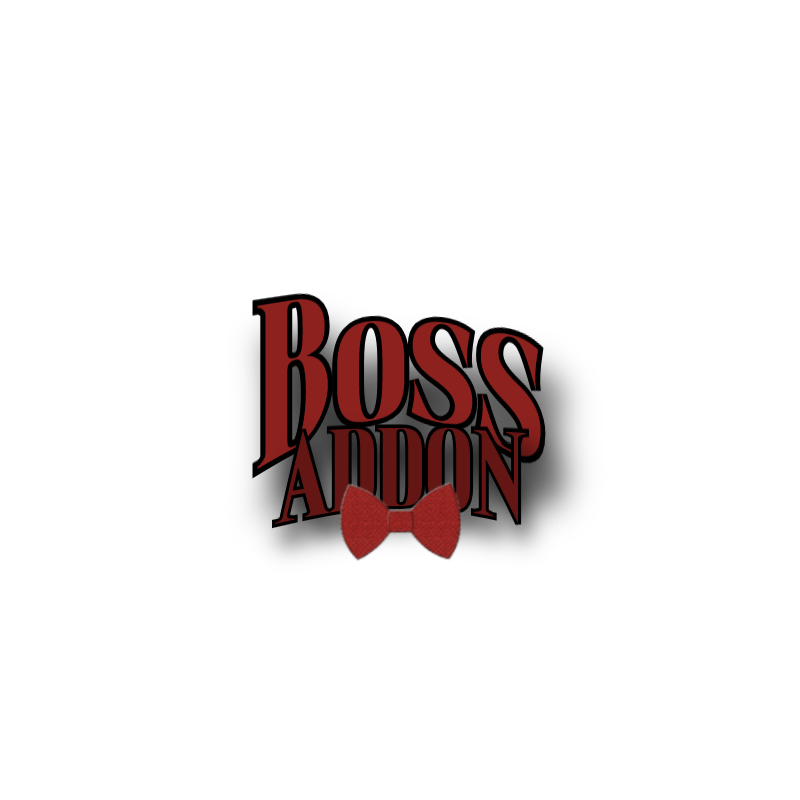

<p align="center">
  
</p>

<p align="center"><sub>Logo by @WaterBoss11</sub></p>

# BossAddon

> An open-source PvP + utility addon for AUTISM Client on Minecraft 26.2 — the merged home of
> **Boss's PVP** (combat) and **BossUtility** (QoL/utility), each toggleable as a half via
> `?bossaddon pvp|utility on|off`.

[](LICENSE)


[](https://github.com/WaterBoss11/BossAddon/releases/latest)
[](https://github.com/WaterBoss11/BossAddon/issues)

A combat addon for AUTISM Client. It adds 31 modules and 3 HUDs covering crystal PvP, melee, survival
automation, movement, and defense. Modules use real vanilla explosion-damage math, silent server-side
rotations, a ghost-safe rotate-before-act packet path, and a shared slot/rotation arbiter so they do not
conflict within a tick.

> [!WARNING]
> Intended for servers without anticheat. On servers that run anticheat or enforce rules, many modules will
> fail or get you banned. Use responsibly.

---

## Combat Modules

| Module | Description |
|--------|-------------|
| AutoCrystal | Places and detonates end crystals with vanilla damage math |
| AutoAnchor | Places, charges, and detonates respawn anchors |
| BedAura | Places and detonates beds in Nether/End |
| KillAura | Attacks nearby entities with smooth rotation |
| AimAssist | Aims toward targets (Linear/Sigmoid/Interpolation) |
| AutoWeapon | Switches to the best weapon before each hit |
| Criticals | Times attacks for critical hits |
| Surround | Places obsidian around you |
| HoleFiller | Fills holes around enemies |
| Trapper | Traps enemies in obsidian |
| ShieldBreaker | Breaks enemy shields with an axe |
| Reach | Extends attack and interact range |
| TriggerBot | Attacks the entity on your crosshair |
| AntiEntityPush | Cancels or reduces entity push (Cancel, or Modify with horizontal/vertical keep %). Reducing push is still anticheat-detectable — same category as the full cancel |

## Automation Modules

| Module | Description |
|--------|-------------|
| AutoPot | Throws splash potions when health is low |
| AutoGap | Eats golden apples when health is low |
| AutoTotem | Keeps a totem of undying in the offhand |
| AutoArmor | Equips the best armor |
| AutoHook | Uses a fishing rod to pull enemies |
| AutoXP | Uses XP bottles |
| AutoClutch | Places blocks to prevent fall damage |
| Offhand | Manages offhand item cycling |
| InvManager | Manages the inventory |
| AutoLeave | Disconnects when health drops below a threshold |
| SelfDestruct | Clears logs, removes the addon jar, empties the recycle bin |
| FastPlace | Removes place delay |
| Hitbox | Expands entity hitboxes |

## Movement Modules

| Module | Description |
|--------|-------------|
| Scaffold | Places blocks beneath you while walking |
| Burrow (Beta) | Buries you in obsidian |
| AntiKnockback | Reduces or cancels knockback |
| NoSlowdown | Removes slowdown while eating/drinking/blocking |

## Render

| Module | Description |
|--------|-------------|
| NoHurtCam | Removes the camera shake/tilt when you take damage |
| Trajectory | Predicts projectile flight paths (bow, pearl, snowball, potion, etc.) before you throw |

## HUD

| Module | Description |
|--------|-------------|
| AimAssist FOV Circle | FOV ring for AimAssist |
| Combat HUD | Combat stats |
| Totem Pops | Totem pop counter |

---

## Team Check

Every combat module has an optional Team check toggle (default off). When on, a nearby player is treated as a
teammate and skipped by targeting, placement, and threat detection if they wear leather armor dyed the same
color as yours.

- Each armor slot where both you and the target wear dyed leather is compared by RGB.
- A slot matches when every channel is within ±15.
- At least 2 slots must match, so default brown leather does not cause false positives.
- If you wear no dyed leather, the check is disabled.

Wired into KillAura, AimAssist, AutoCrystal, AutoAnchor, BedAura, TriggerBot, ShieldBreaker, Trapper,
HoleFiller, and Surround.

## Friends List

KillAura holds a shared **Friends list** (an editable list of player names) that all of the team-check modules
above also respect. Any player whose name matches an entry (case-insensitive) is skipped whenever the list has
entries — independent of Team check. Bind **Add target to friends** in KillAura to add your current crosshair or
combat target to the list on the fly. The list persists via AUTISM's settings.

---

## Requirements

- Minecraft 26.2
- AUTISM Client 3.4
- Fabric API 0.152.2+26.2
- Java 25+

---

## Build

```bash
# 1. Place the AUTISM Client 3.4 API jar in libs/ as autism-3.4.jar.
# 2. Point JAVA_HOME at a JDK 25 install, then build:
gradlew build          # Windows
./gradlew build        # macOS / Linux
# Output: build/libs/boss-pvp-<version>.jar
```

Match the versions in `gradle/libs.versions.toml` (minecraft, fabric, autism) to the AUTISM release you build
against.

---

## Installation

1. Download the latest release from the [Releases](https://github.com/WaterBoss11/BossAddon/releases/latest) page.
2. Drop `boss-pvp-<version>.jar` into your `.minecraft/mods/` folder.
3. Launch with AUTISM Client 3.4 and Fabric API for Minecraft 26.2. The modules appear under the Boss's PVP
   and BossUtility addon categories — the two halves of BossAddon. Toggle either half with
   `?bossaddon pvp|utility on|off`: turning a half off disables its modules and skips their ticking entirely,
   and turning it back on restores exactly the modules that were enabled.

> **Command prefix — `?`, not `/`.** Every BossAddon command starts with `?` (e.g. `?bossaddon help`). `/` is a
> real Minecraft command character sent to the server; `?` is not, so BossAddon intercepts it client-side. A
> chat line is treated as a command **only** when it begins with `?bossaddon` as a complete word (followed by a
> space or the end of the line). Anything else that starts with `?` — a lone `?`, `?hi`, `?bossaddonx`, or a
> server's own `?`-prefixed chat commands — is sent as normal chat and never eaten. (`?` was chosen because it
> can't collide with AUTISM's command prefix, which is one of `. % - _ * # @ & =`.)

---

## BossChat (cross-server chat)

BossChat lets BossAddon users talk to each other **across different Minecraft servers** through a shared relay.
It is **on by default** on a public build: a Mojang-verified account connects automatically and can start
chatting. You can turn it off completely at any time (see **Opt-out** below).

**Scopes** — where your chat goes:

- **Global** — everyone connected to the relay.
- **Server** — only BossAddon users on the *same* Minecraft server you're on.
- **Party** — a private group you create by inviting people.
- **DM** — one specific person. DMs go **only** to that recipient — never echoed, logged, or relayed anywhere else.

**How to use it.** Open the chat box and click the **BossChat** toggle button (cycles Off → Global → Server →
Party); while a scope is active, what you type is relayed instead of going to the server (lines starting with
`/` are never touched). Or use the commands:

```
?bossaddon chat global | server | off      choose where your typed chat goes
?bossaddon chat g <msg>                     send one line to global
?bossaddon chat s <msg>                     send one line to this server's users
?bossaddon chat dm <user> <msg>             private message someone
?bossaddon chat reconnect                   reconnect to the relay
?bossaddon chat disable | enable            turn BossChat fully off / back on
?bossaddon party <user>                     invite someone to your party
?bossaddon party accept | decline | leave | list
?bossaddon party msg <msg>                  message your party
```

**Trust model — verified vs unverified.** Every message shows whether its sender is **verified**. *Verified*
means the relay confirmed, through Mojang's session servers, that the sender owns that premium account.
*Unverified* means a cracked/offline account that only *self-reports* its name. Access is hybrid: **any verified
account can use BossChat freely, with no invite**; **unverified identities are gated** — they must be
allowlisted/invited, and an unverified user can **never** take a verified user's name (the relay blocks it).
Treat unverified names as unproven.

**What's sent.** When BossChat is on, the relay receives: **your Minecraft username** and verified/unverified
status (shown to people in your scope), **your current server address** — used to route *Server*-scope messages
to the right people — and the **message text** you send. Message text is capped at **512 characters** and
stripped of control characters both before it's sent and again before it's shown to you. Your account password
is **never** sent for a verified account; it's only used on the unverified path, and only if you explicitly set
one to claim/keep an offline name. Note this is different from crash & kick reporting below, which deliberately
does *not* send your server address.

**Party warp (join a party member's server).** A party member can *ask* you to join the server they're on:

```
?bossaddon party warp [user]                propose your current server to the party (or one member)
?bossaddon party warp accept | decline      respond to a warp request someone sent you
```

It is always a **request, never an automatic connect**. When someone proposes a warp you get a prompt showing
**exactly which server address** you'd be sent to — *"&lt;sender&gt; wants you to join them on &lt;address&gt;"* —
and **nothing happens unless you type `accept`**. On accept, your client joins that address the same way the
vanilla **Join Server** button does (it uses Minecraft's own connect path — no server-list edits, no
automation). Requests expire after two minutes, and any request carrying a malformed address is ignored. The
**only** data exchanged is the **server address** and **which party member** proposed it — nothing about your
account, location, or anything else.

**Opt-out.** `?bossaddon chat disable` turns BossChat **completely off** — it disconnects and won't reconnect on
this or any future launch (persisted as `relay.enabled=false`). `?bossaddon chat enable` turns it back on. Note
that `?bossaddon chat off` only stops relaying *your* typed chat — you still **receive** messages while
connected; use **disable** to stop participating entirely.

---

## Crash & kick reporting (privacy)

By default this addon reports **kicks and crashes** to the developer's Discord to help fix bugs. Each report
contains:

- the event type and its reason text — disconnects are labelled by what actually happened: **Server rejected
  connection** (VPN/proxy block, wrong loader, whitelist, ban), **Kicked** (kicked mid-game), **Timed out**,
  **Disconnected**, or **Crash**,
- **your Minecraft username** (the reporting player's own name — never anyone else's),
- which BossAddon modules were enabled at that moment, and
- **a short excerpt of your client log from around the event** (roughly the last ~10–15 seconds plus a few
  seconds after), attached as a downloadable `flag-log-<timestamp>.txt` file, to help debugging.

It does **not** collect or send your server name or server IP.

**About the log excerpt — please read.** The excerpt is delivered as a **sanitized `.txt` attachment** on the
report (not pasted into the message). Before it leaves your client it is run through a sanitizer that strips IP
addresses (IPv4/IPv6), server connect targets and common web domains, your Windows username in file paths
(`C:\Users\<name>\…`), and player names in the standard Minecraft log formats — chat `<name>`, join/leave,
disconnect, advancements, `Setting user`, and the `name[/address]` connection line — plus every remaining exact
occurrence of **your own** username (it's already sent as the Player field). **We still cannot guarantee 100%
removal:** log text is freeform, so **other players'** names in server-custom chat formats, or in a self-hosted
(singleplayer/LAN) world's command output (e.g. `/give … to <name>`, `Teleported <name>`), may slip through —
those aren't reliably distinguishable from ordinary log text, and we deliberately avoid blanket rules that would
shred legitimate logs. Treat the file as "scrubbed, not guaranteed clean." BossUtility now ships inside
BossAddon: its flag reporter still exists but automatically defers to the main (Boss's PVP) reporter, so a
single combined report goes out. Reports are deduplicated so a reconnect loop can't spam the channel.

**To turn it off:** open the **Crash & Kick Reports** module and uncheck **"Report crashes & kicks"**. That
opts you out completely — no report, and no log file, goes out.

---

## Crash safeguard (velocity clamp)

Some servers send **malformed or malicious velocity** for your player — real crash reports from this addon
carried per-axis momentum around **1.8e38 / 2.8e38 / 2.1e38**. Values that large overflow Minecraft's own
position/section math and crash the client deep inside vanilla's `EntitySectionStorage`/collision code
(reproducible even with Lithium fully disabled, so it isn't an optimisation-mod bug — and the identical values
turned up on two separate accounts, which points at a deliberate server-side trigger rather than a glitch).

The **Velocity Crash Guard** module (under the **Client** category, **on by default**) caps incoming velocity to
a sane maximum before vanilla ever processes it, so a bad value can't reach the code that crashes. The cap sits
far above anything real gameplay produces — vanilla movement, elytra + firework boosts, riptide, ender pearls
and even extreme TNT/explosion launches all stay orders of magnitude below it — so **legitimate high-speed
motion is never affected**; only impossible values are clamped, and you get a one-time chat notice when it
happens.

This is a **purely defensive, local-only** protection, the same honest category as the Anti-Knockback
disclosure: it protects *your own client* from processing an impossible value. It never changes anything you
send to the server and never deceives it. You can turn it off under **Client → Velocity Crash Guard**, but
there's no reason to.

---

## Reconfigure-loop guard

A malicious server can repeatedly force your client from the play phase back into Minecraft's **configuration**
phase right after you load in, trapping you in an endless **Loading terrain → Reconfiguring → Loading terrain**
loop that never lets you actually play.

The **Reconfigure Loop Guard** module (under the **Client** category, **on by default**) watches those
play→configuration transitions and, if they repeat too many times in a short window (3 within ~12 seconds),
**cleanly disconnects** you with a clear reason instead of leaving you stuck indefinitely. A single legitimate
reconfigure — e.g. a server-side resource-pack reload — never trips it.

It is **detect-and-disconnect only, never deceive-and-continue.** It never alters, forges, suppresses, or
fakes any packet or acknowledgment sent to the server — the server's reconfigure request is always handled
normally; the guard only *observes* the phase changes and, on a detected loop, closes the **local** connection
(the same "observe and leave" category as the crash & kick reporting). If the flag reporter is on, the auto-
disconnect is logged there as a **"Reconfigure loop"** event. Toggle it under **Client → Reconfigure Loop
Guard**.

---

## Update check

On launch the addon checks whether a newer version has been released and, if so, tells you — with a one-time
chat notice (including a link to the release page) and a small HUD badge. Unlike crash & kick reporting above,
this is a **fixed, always-on behavior of the addon, not a configurable setting** — there is no toggle to
disable it.

It is **read-only** and carries **no personal information**. The only thing that leaves your client is a
single plain HTTPS `GET` to the public GitHub Releases API for this repo — exactly the request your browser
makes when you open the releases page. Nothing is ever downloaded, extracted, or installed: the check only
reads the latest release tag and compares it to the version baked into your build. It is fire-and-forget, so
if GitHub is unreachable or the check fails for any reason it fails silently and never blocks startup.

---

## License

GPL-3.0 — see [LICENSE](LICENSE).
