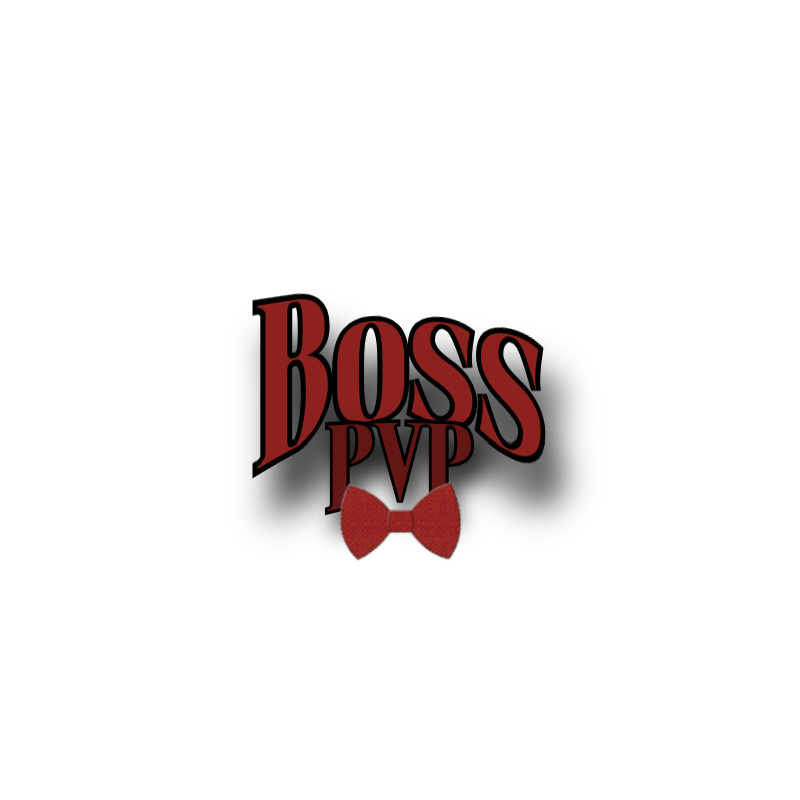

<p align="center">
  
</p>

<p align="center"><sub>Logo by @WaterBoss11</sub></p>

# BossAddon

> An open-source PvP + utility addon for AUTISM Client on Minecraft 26.2 — the merged home of
> **Boss's PVP** (combat) and **BossUtility** (QoL/utility), each toggleable as a half via
> `/bossaddon pvp|utility on|off`.

[](LICENSE)


[](https://github.com/WaterBoss11/BossAddon/releases/latest)
[](https://github.com/WaterBoss11/BossAddon/issues)

A combat addon for AUTISM Client. It adds 31 modules and 3 HUDs covering crystal PvP, melee, survival
automation, movement, and defense. Modules use real vanilla explosion-damage math, silent server-side
rotations, a ghost-safe rotate-before-act packet path, and a shared slot/rotation arbiter so they do not
conflict within a tick.

> [!WARNING]
> Intended for servers without anticheat. On servers that run anticheat or enforce rules, many modules will
> fail or get you banned. Use responsibly.

---

## Combat Modules

| Module | Description |
|--------|-------------|
| AutoCrystal | Places and detonates end crystals with vanilla damage math |
| AutoAnchor | Places, charges, and detonates respawn anchors |
| BedAura | Places and detonates beds in Nether/End |
| KillAura | Attacks nearby entities with smooth rotation |
| AimAssist | Aims toward targets (Linear/Sigmoid/Interpolation) |
| AutoWeapon | Switches to the best weapon before each hit |
| Criticals | Times attacks for critical hits |
| Surround | Places obsidian around you |
| HoleFiller | Fills holes around enemies |
| Trapper | Traps enemies in obsidian |
| ShieldBreaker | Breaks enemy shields with an axe |
| Reach | Extends attack and interact range |
| TriggerBot | Attacks the entity on your crosshair |
| AntiEntityPush | Prevents entities from pushing you |

## Automation Modules

| Module | Description |
|--------|-------------|
| AutoPot | Throws splash potions when health is low |
| AutoGap | Eats golden apples when health is low |
| AutoTotem | Keeps a totem of undying in the offhand |
| AutoArmor | Equips the best armor |
| AutoHook | Uses a fishing rod to pull enemies |
| AutoXP | Uses XP bottles |
| AutoClutch | Places blocks to prevent fall damage |
| Offhand | Manages offhand item cycling |
| InvManager | Manages the inventory |
| AutoLeave | Disconnects when health drops below a threshold |
| SelfDestruct | Clears logs, removes the addon jar, empties the recycle bin |
| FastPlace | Removes place delay |
| Hitbox | Expands entity hitboxes |

## Movement Modules

| Module | Description |
|--------|-------------|
| Scaffold | Places blocks beneath you while walking |
| Burrow (Beta) | Buries you in obsidian |
| AntiKnockback | Reduces or cancels knockback |
| NoSlowdown | Removes slowdown while eating/drinking/blocking |

## Render

| Module | Description |
|--------|-------------|
| NoHurtCam | Removes the camera shake/tilt when you take damage |
| Trajectory | Predicts projectile flight paths (bow, pearl, snowball, potion, etc.) before you throw |

## HUD

| Module | Description |
|--------|-------------|
| AimAssist FOV Circle | FOV ring for AimAssist |
| Combat HUD | Combat stats |
| Totem Pops | Totem pop counter |

---

## Team Check

Every combat module has an optional Team check toggle (default off). When on, a nearby player is treated as a
teammate and skipped by targeting, placement, and threat detection if they wear leather armor dyed the same
color as yours.

- Each armor slot where both you and the target wear dyed leather is compared by RGB.
- A slot matches when every channel is within ±15.
- At least 2 slots must match, so default brown leather does not cause false positives.
- If you wear no dyed leather, the check is disabled.

Wired into KillAura, AimAssist, AutoCrystal, AutoAnchor, BedAura, TriggerBot, ShieldBreaker, Trapper,
HoleFiller, and Surround.

## Friends List

KillAura holds a shared **Friends list** (an editable list of player names) that all of the team-check modules
above also respect. Any player whose name matches an entry (case-insensitive) is skipped whenever the list has
entries — independent of Team check. Bind **Add target to friends** in KillAura to add your current crosshair or
combat target to the list on the fly. The list persists via AUTISM's settings.

---

## Requirements

- Minecraft 26.2
- AUTISM Client 3.4
- Fabric API 0.152.2+26.2
- Java 25+

---

## Build

```bash
# 1. Place the AUTISM Client 3.4 API jar in libs/ as autism-3.4.jar.
# 2. Point JAVA_HOME at a JDK 25 install, then build:
gradlew build          # Windows
./gradlew build        # macOS / Linux
# Output: build/libs/boss-pvp-<version>.jar
```

Match the versions in `gradle/libs.versions.toml` (minecraft, fabric, autism) to the AUTISM release you build
against.

---

## Installation

1. Download the latest release from the [Releases](https://github.com/WaterBoss11/BossAddon/releases/latest) page.
2. Drop `boss-pvp-<version>.jar` into your `.minecraft/mods/` folder.
3. Launch with AUTISM Client 3.4 and Fabric API for Minecraft 26.2. The modules appear under the Boss's PVP
   and BossUtility addon categories — the two halves of BossAddon. Toggle either half with
   `/bossaddon pvp|utility on|off`: turning a half off disables its modules and skips their ticking entirely,
   and turning it back on restores exactly the modules that were enabled.

---

## Crash & kick reporting (privacy)

By default this addon reports **kicks and crashes** to the developer's Discord to help fix bugs. Each report
contains:

- the event type and its reason text — disconnects are labelled by what actually happened: **Server rejected
  connection** (VPN/proxy block, wrong loader, whitelist, ban), **Kicked** (kicked mid-game), **Timed out**,
  **Disconnected**, or **Crash**,
- **your Minecraft username** (the reporting player's own name — never anyone else's),
- which BossAddon modules were enabled at that moment, and
- **a short excerpt of your client log from around the event** (roughly the last ~10–15 seconds plus a few
  seconds after), attached as a downloadable `flag-log-<timestamp>.txt` file, to help debugging.

It does **not** collect or send your server name or server IP.

**About the log excerpt — please read.** The excerpt is delivered as a **sanitized `.txt` attachment** on the
report (not pasted into the message). Before it leaves your client it is run through a sanitizer that strips IP
addresses (IPv4/IPv6), server connect targets and common web domains, your Windows username in file paths
(`C:\Users\<name>\…`), and player names in the standard Minecraft log formats — chat `<name>`, join/leave,
disconnect, advancements, `Setting user`, and the `name[/address]` connection line — plus every remaining exact
occurrence of **your own** username (it's already sent as the Player field). **We still cannot guarantee 100%
removal:** log text is freeform, so **other players'** names in server-custom chat formats, or in a self-hosted
(singleplayer/LAN) world's command output (e.g. `/give … to <name>`, `Teleported <name>`), may slip through —
those aren't reliably distinguishable from ordinary log text, and we deliberately avoid blanket rules that would
shred legitimate logs. Treat the file as "scrubbed, not guaranteed clean." BossUtility now ships inside
BossAddon: its flag reporter still exists but automatically defers to the main (Boss's PVP) reporter, so a
single combined report goes out. Reports are deduplicated so a reconnect loop can't spam the channel.

**To turn it off:** open the **Crash & Kick Reports** module and uncheck **"Report crashes & kicks"**. That
opts you out completely — no report, and no log file, goes out.

---

## Update check

On launch the addon checks whether a newer version has been released and, if so, tells you — with a one-time
chat notice (including a link to the release page) and a small HUD badge. Unlike crash & kick reporting above,
this is a **fixed, always-on behavior of the addon, not a configurable setting** — there is no toggle to
disable it.

It is **read-only** and carries **no personal information**. The only thing that leaves your client is a
single plain HTTPS `GET` to the public GitHub Releases API for this repo — exactly the request your browser
makes when you open the releases page. Nothing is ever downloaded, extracted, or installed: the check only
reads the latest release tag and compares it to the version baked into your build. It is fire-and-forget, so
if GitHub is unreachable or the check fails for any reason it fails silently and never blocks startup.

---

## License

GPL-3.0 — see [LICENSE](LICENSE).
